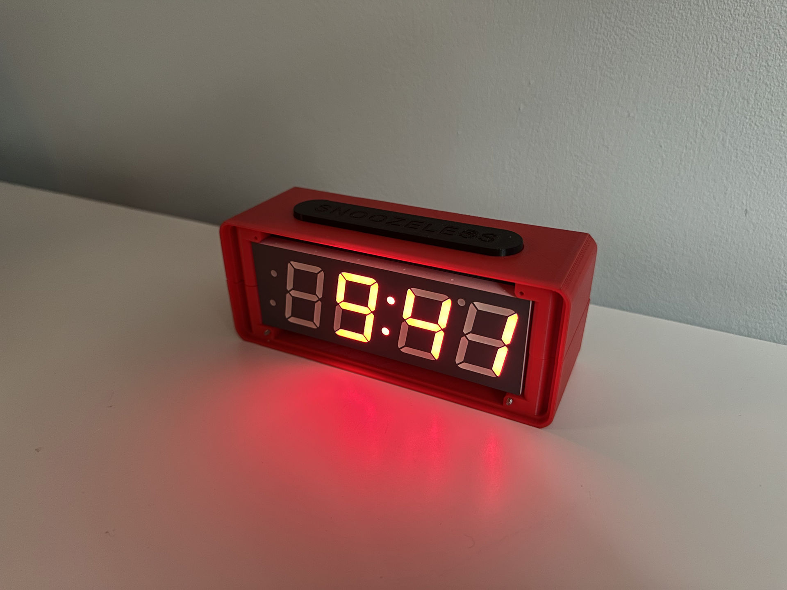

# Snoozeless

Make yourself a morning person.

## The Problem

I’m a night owl by nature. Whether it’s genetic or a habit picked up in school, I’ve always had a tendency to wake up around 8 or 9 and fall asleep around 1 or 2.

On the rare occasion that I do wake up early (like, 6 or earlier), I always have a fantastic day. I've usually exercised, made breakfast, and gotten some work done by the time others are waking up. I feel like I have a head start on everyone else, setting the tone for a productive day.

Once I'm awake, I feel great, but the challenge is getting to that point. My discipline is at its absolute lowest at the moment my alarm sounds. No matter how good my intentions were when I set it the night before, and despite knowing logically that getting up is the right decision, I usually end up hitting snooze. And then hitting it again. And again. An embarassing number of 9-minute increments later, I finally get up around the time that I would have naturally, having accomplished nothing by setting an alarm other than decreasing the quality of my last hour of sleep.

I needed a way to change the incentives at the critical moment of decision, to make it more immediately expensive to stay in bed than to leave it.

## The Solution

The solution I landed on is an alarm clock that goes off not once, but twice. The first alarm functions like any regular alarm — it goes off, you wake up, and you turn it off. Turning off the first alarm, however, triggers a countdown to a second. The key difference is that the only way to cancel the countdown (or turn off the second alarm, if you've run out of time) is to physically reach a pre-determined geographic location (the gym, work, class, etc.). This design changes your incentives while you’re contemplating whether to get up. With the countdown ticking, every minute spent in bed reduces the time you have to reach your destination. You know that if the countdown reaches zero, the alarm will go off and you won’t be able to stop it.

Initially, I thought this could be a simple mobile app, but it’s actually impossible to implement on a device over which you don’t have full control of the hardware. If the alarm is going off on your phone, it can be turned off by simply quitting the app. This solution, then, requires a :sparkles:_distributed system_:sparkles:: an embedded device with full control over its noise-making peripherals to serve as the alarm clock, and a mobile app to confirm that you've reached your target location.

## Couldn't You Just...

### Unplug it?

No. There's a battery inside that's charging whenever it's plugged in. It can run for hours without wall power.

### Throw it across the room/move it to a different one?

No. There are screw holes under the snooze(less) bar that allow you to anchor the clock to something solid (e.g. your nightstand) if you really need to.

### Disconnect the internet?

No. Once the wakeup cycle begins, all logic runs onboard. All you accomplish by cutting the internet is to make it impossible to tell Snoozeless you've reached your destination. The second alarm will sound as scheduled until internet is restored and you've reached your destination.

### Turn it off via the server?

No. When the mobile app tells the server that you've reached your destination, it signs that message with a private key. Snoozeless validates the message with the corresponding public key. Even for me, with full access to the application's backend, it's cryptographically impossible to turn off an alarm by any method other than getting my phone to the correct geographic coordinates.

### Smash it with a hammer?

Yes. Yes, you could smash it with a hammer. I've put so much work into Snoozeless that I don't think some extra sleep would ever be worth that to me. If the tradeoff is different for you, the CAD files are [here](cad); I suggest machining it from steel.

## The Implementation

The pieces of the system are as follows:

### Database

Stores application state. Built with [Supabase](https://supabase.com/). There are only two tables, `devices` and `alarms`, plus the tables that Supabase generates automatically for auth and other concerns.

### Server

Handles routing and backend logic. Pre- and post-processes most of the database reads and writes. Implemented with [Hono](https://hono.dev/), which is pretty much just a modern, lightweight, TypeScript-first alternative to [Express](https://expressjs.com/). I've really enjoyed using it. Currently I just run the server locally on my machine, but plan to deploy it to the cloud in a Docker container running Node.

### Mobile Application

The need to know the user's location requires a mobile app. This one is built with [Flutter](https://flutter.dev/) and thus written in [Dart](https://dart.dev/).

### Embedded Application

Lastly, a standalone device needs a board and firmware. The [ESP32](https://www.espressif.com/en/products/socs/esp32) by Espressif is a very popular System on a Chip for Internet of Things applications. I have some experience programming these using the [Arduino](https://www.arduino.cc/) framework, but for this project I chose to use Espressif's own [ESP-IDF](https://github.com/espressif/esp-idf) for its lower-level control (and just to learn something new). The ESP-IDF libraries are written in C but fully support C++, which I took advantage of due to my proclivity for and/or addiction to object-oriented programming.

## Build One

I'm putting together a full build guide, but it's still a work in progress. Unfortunately, if you want to make your own, you're going to have to reverse engineer it from the resources in this repo. The CAD files are designed around these components from Adafruit:

- [Adafruit ESP32 Feather V2 - 8MB Flash + 2 MB PSRAM - STEMMA QT](https://www.adafruit.com/product/5400)
- [Breadboard-friendly 2.1mm DC barrel jack](https://www.adafruit.com/product/373)
- [Tactile Button switch (6mm) x 20 pack](https://www.adafruit.com/product/367)
- [Large Enclosed Piezo Element w/Wires](https://www.adafruit.com/product/1739)
- [Adafruit 7-Segment Backpack - 1.2" Tall Digits](https://www.adafruit.com/product/1271)
- [Red 7-segment clock display - 1.2" digit](https://www.adafruit.com/product/1264)
